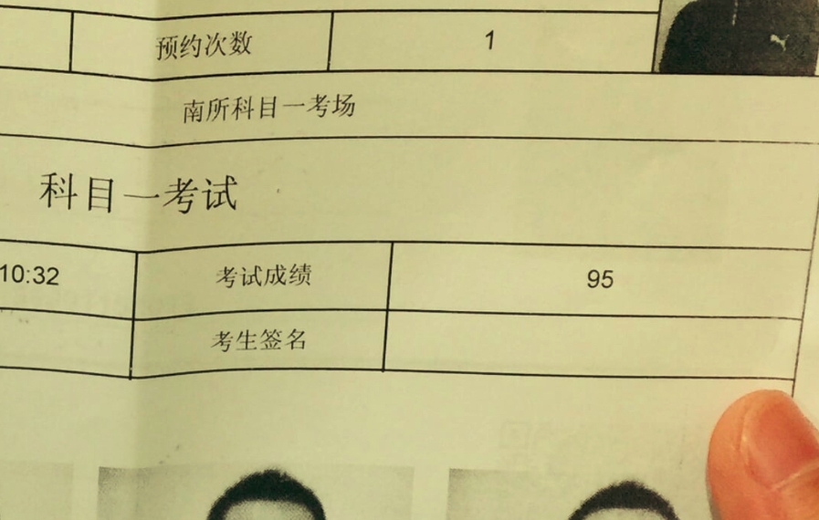
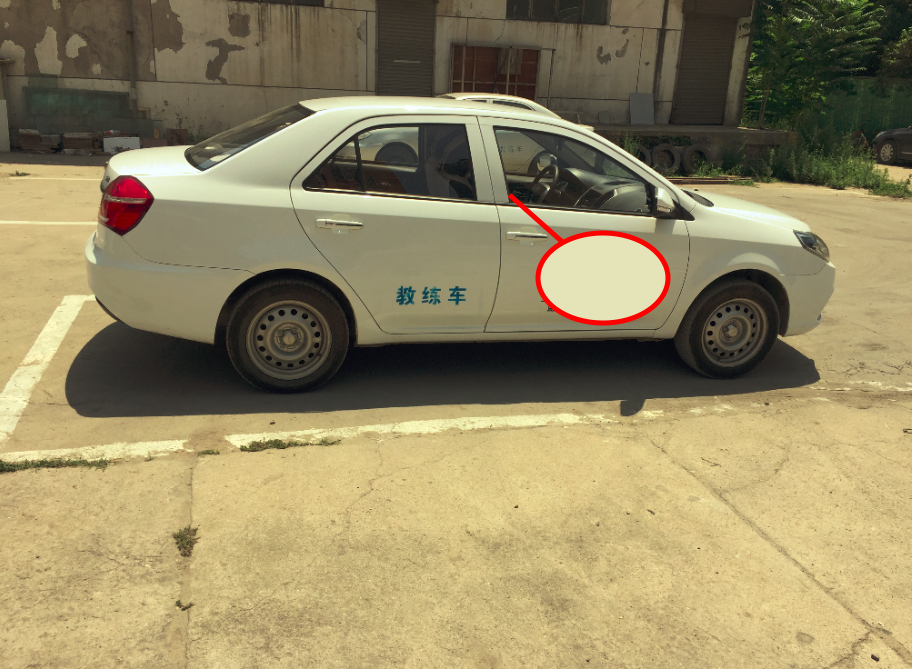

# 菜鸟司机上路记

&nbsp;&nbsp;&nbsp;&nbsp; 2019年9月21号，接到物业通知可以提前拿到车位了，无论是对生活还是对工作，我都必须主动地做出一些改变，于是就下定决心开始学车。假期是计划回家的，所以节前报了驾校，因为是纯新手司机，在这里就记录一下我是如何成为司机并上路的吧。

+ [选择正规驾校]()  
+ [报名-进行司机常规上路体检-等待体检信息录入系统]()  
+ [等待驾校通知 并在线预约科目一考试]()  
+ [拿科目一考试通过的成绩单 去驾校练习科目二]()  
+ [科目二 上车练习]()  
+ [科目二 持续练习]()  
+ [未完待续...]()  

### 选择正规驾校  
  - 选择的参考依据： 当地大牌正规化驾校 >> 练车场地尽可能离住的地方近 >> 驾校口碑较好  
    正规化的驾校，一定得先保证安全第一，不管是人身安全还是财产安全，都不要花了钱打水漂了；随着城市的扩张，东奔西跑是正常的，练车时间我考虑到尽量选择在周末，本着不浪费太多额外精力的原则，就近找驾校；如何寻找一个城市驾校的口碑呢？ 一开始我是想到从互联网上获取，但是寻找一圈后发现，广告太多（看来竞争太激烈了）。于是我借着最近几次滴滴出行的机会，前后问了三位司机师傅，向他们打听市区内口碑较好的驾校。

  - 通过什么途径驾校报名？  
    我的思路是，驾校报名途径，坚决走线上渠道。因为所有线上渠道，会记录买家、驾校、平台三方反馈，一旦在报驾校过程中遇到什么问题，都可以有清晰了解、投诉、或者工单跟进。最终我是通过京东平台报名驾校，为了避嫌，我就不挂出连接了。建议在下单之前，提出要驾校师傅带着去练车场地参观的，因为还是线下去实地看一看场地，觉得满意后再下单才最放心。

### 报名-进行司机常规上路体检-等待体检信息录入系统  
&nbsp;&nbsp;&nbsp;&nbsp; 为了尽早预约上科目一的考试，一大早就约起教练去考驾定点医院体检，其实一点都不麻烦，10分钟不到全部检查完，主要是视力、躯干、四肢、听觉的测试，确保行车人和行人的安全。

&nbsp;&nbsp;&nbsp;&nbsp; 由于我是外地户口，驾照报考的上报材料中还需要提供居住证，多亏之前在办护照的时候办理过居住证，在这里没耽误时间。特别注意一点：<b>一定要记住所有身份证信息相关的复印材料，尽量去手写一份【仅供办理xxx业务所用，它用或复印无效！】</b>。

&nbsp;&nbsp;&nbsp;&nbsp; 提交完材料后，就可以催促教练帮你递交科目一报备材料了，教练说三、四天左右，就可以自己在网上申报科目一考试了。

### 等待驾校通知 并在线预约科目一考试  
&nbsp;&nbsp;&nbsp;&nbsp; 我是在提交完材料，体检完的第三天接到驾校通知，说可以预约科目一考试了，比我想象中要快。以下是[西安市车管所注册预约考试网站](https://sn.122.gov.cn)，使用在提交驾考资料时预留的手机号注册、登陆、预约即可完成，我一看最早的考试时间是10月14号，所以对未来计划考驾照的同学而言，还是一切提早准备比较靠谱。教练建议不要刷题刷太久，考前一到两天看题，题库只有1000道题，绝对来得及，而且效果更好。

### 拿科目一考试通过的成绩单 去驾校练习科目二  
&nbsp;&nbsp;&nbsp;&nbsp; 周天刷了整整一天的考试题，挺有感觉的，14号上午考完科目一，顺利通过。考场是考生排成一队，按排队的顺序进去考试，机器答题，而且当场出成绩，半小时后领成绩单。

&nbsp;&nbsp;&nbsp;&nbsp; 整体考试因为有题库的原因，还是简单的，也许是好久没进过考场了，感觉有点紧张。试卷一共100道题，前50道题我已经错了4道了，其中两道答错居然是手抖了一下，对于90分以上才算合格的考试，后面50道题目，真的是仔细审完题才作答的，别的不多说了，就总结出一个规律吧： <b>所有科目一的考题，正确答案，永远是看起来最怂的选项。</b> 现在菜鸟司机终于可以合法的去驾驶教练车了，这个学车的节奏，比想象中要快很多，挺顺利的，希望再接再厉。推荐一下 刷题App.

  

  

### 科目二 上车练习  
&nbsp;&nbsp;&nbsp;&nbsp; 19号，周六，今天第一次练车，练车居然练了一天，前前后后6个小时，尤其是下午，只有教练带着我一个人在练习，简直是VIP待遇了。今天上午主要练习：手刹、油门、刹车、离合器、挂档（1/R）、点火、怠速前进与后退，下午开始接触倒车入库。 以下是我记录下来适合我自己的练习过程。 

- 停车的时候 回空档 拉手刹

- 开车的时候 松手刹

- <b>点火的时候，一定要挂空档</b>（我不小心 挂着倒挡点火，启动的一瞬间，整个车子向后窜出，多亏场地足够大也及时踩刹车了 否则后果很严重）  

- 换挡的时候 要踩离合踩到底 否则不容易换档

- 刹车的时候 也要踩离合

- 怠速前进、后退的时候，离合器松的太快容易熄火，后来试着只用前脚掌踩离合，慢慢松离合，就感觉好很多了。

- 油门暂时还没踩过，还是一步一步来，这样才能把车给开稳了.

停车倒库的要诀：

+ 0.系安全带 空挡点火 启动机车  

+ 1.离合踩到底，挂1档  

+ 2.轻轻松开离合，让车子向前缓慢行驶

+ 3.当视线-车前引擎盖-正前方的实线 构成一条直线时， 向左快速打方向盘，一直打到底，这个过程中要控制好车速，如果车行驶过快，就把离合踩深一点，如果车速太慢，就稍微松一些离合

+ 4.当车辆左转与正左方接近平行时，回方向盘到初始位置，向前行驶，出库完成

+ 5.离合踩到底，挂R档

+ 6.轻轻松开离合，让车子向后缓慢倒退

+ 7.当视线-左后视镜-左侧地上的实线 构成一条直线时，向左快速打方向盘，一直打到底，这个过程中要控制好车速，如果车行驶过快，就把离合踩深一点，如果车速太慢，就稍微松一些离合，根据后视镜，纠正回库距离

+ 8.当车辆回退到与正前方实线接近平行时，回方向盘到初始位置，缓慢倒车

+ 9.当视线-车辆左后视镜最下方-最近的实线 构成一条直线时 停车。倒库完成

今日总结： 离合控制，还没熟悉好，因为我还是容易让车子熄火，不过今天练车练了一整天，还是挺开心的，比预期中要简单一些，成功完成了好几次停车倒库的操作，就是慢了点。还是要勤于练习，才能够熟能生巧。

  

&nbsp;&nbsp;&nbsp;&nbsp; 26号，周六，下午两点来练车，发现又是自己一个人，突然感觉到一阵担心，害怕这个驾校会倒闭，然后关门跑路了。今天天气还可以，教练给我换了一辆车练习，黑色的吉利小车，明显感觉这个车的挂掉太硬了，不如我第一次练车时用的BYD，心里还泛着嘀咕，以后练车是不是都用这台车来练习。因为只有我自己在车里，一开始还有点发怵，在车里待了一会，后来慢慢地也不怵了。好好练车，争取早日合法上路才是目标。  

&nbsp;&nbsp;&nbsp;&nbsp; 第二次遇到的问题：
- 怠速行驶的时候 还是容易熄火，但比第一次练车时 已经好很多了  
- 出库，回库 打方向盘的时候，容易早打或者晚打 方向盘，导致倒库的时候，停车不到位 教练给的建议是：尽量压低速度，慢慢出库喝倒库。

+ 今天只练习左倒库、出库这个动作。 希望下次再来的时候，感觉会更好。
